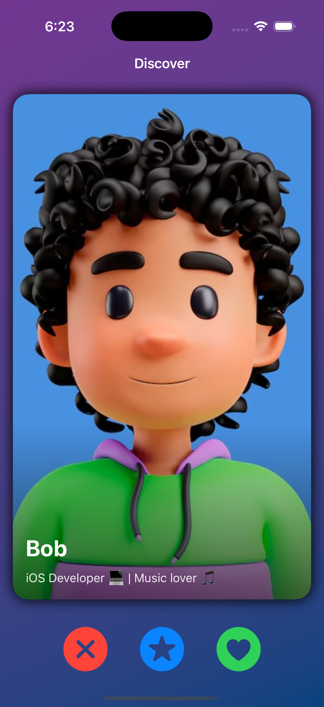
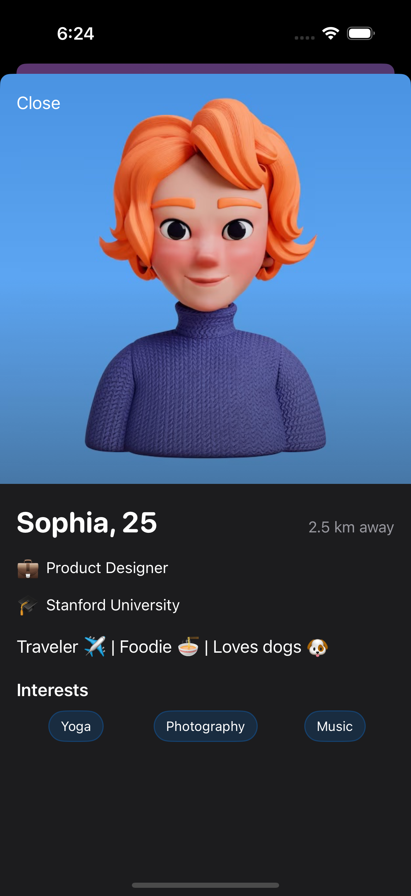

# Profile Swipe POC 🎴

A proof-of-concept iOS app built with **SwiftUI**, showcasing swipeable profile cards (like Tinder) with a profile detail screen.

---

This project demonstrates modern iOS best practices:  
- 🧹 **SwiftLint integrated** to enforce consistent Swift code style and conventions
- 🏛 **MVVM architecture** for clean separation of concerns  
- ⚡️ **Swift Concurrency (`async/await`)** for data loading  
- 📂 **Local JSON file** as mock data source  
- 👆 **Swipe gestures** for interactions  
- 🎨 **Dynamic badge overlays** (LIKE / NOPE / SUPER LIKE) 

## ✨ Features
- Swipe **left**, **right**, or **up** on cards:
  - ✅ Right → "Like"  
  - ❌ Left → "Nope"  
  - ⭐️ Up → "Super Like"  
- Overlays that fade in dynamically while swiping  
- MVVM-driven card data loaded from `profiles.json`  
- 👆 **Tap a card** to view detailed profile info  
- 📱 Smooth **animations & gestures**  
- 📂 **Mock data** used for simplicity (easily replaceable with API/JSON)  
- 🌓 Supports **Dark Mode** (out of the box with SwiftUI)

---

## 🛠 Tech Stack
- **Language:** Swift 5.9+  
- **Frameworks:** SwiftUI  
- **Architecture:** MVVM (scalable & clean)  
- **Deployment Target:** iOS 17+

---

## 📸 Screenshots

| Swipe Screen | Profile Detail |
|--------------|----------------|
|  |  |

---

## 📹 Demo

---

## 🚀 Getting Started

### 1. Clone Repository

```bash
git clone https://github.com/your-username/ProfileSwipePOC.git
cd ProfileSwipePOC
```

### 2. Open Project in Xcode

Double-click `ProfileSwipePOC.xcodeproj` or `ProfileSwipePOC.xcworkspace`.

### 3. Run the App

Select a simulator or device and press **Run (⌘R)**.

